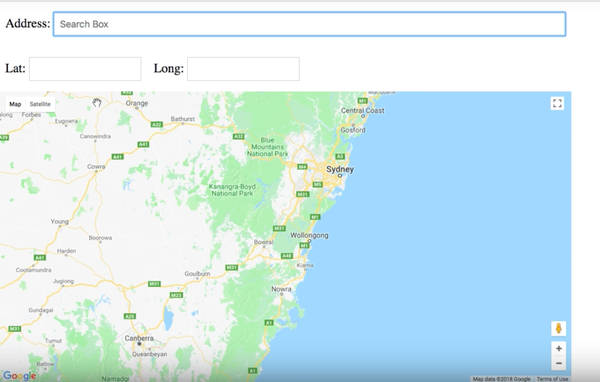

# Google Maps JavaScript API

:pushpin: A Demo for Google Maps JavaScript API

## Video Tutorial :video_camera:

1. [Watch Demo Tutorial](https://www.youtube.com/watch?v=yhhkNtdg5x0&list=PLD8nQCAhR3tT9dU8JKLpG3av-WMQGPPFP)

## Step-1-GET API KEY :old_key:
  * [API Dashboard](https://console.cloud.google.com/apis/dashboard)
  * [Google Maps JavaScript Tutorial](https://developers.google.com/maps/documentation/javascript/tutorial)
  * [Get API Key](https://developers.google.com/maps/documentation/javascript/get-api-key)

## Step-2 Create Project :file_folder:
 
  * Login to your google api dashboard
  * Click on Credentials and Create Credentials ( Create Credentials > Api key ) for the above API
  * Get the API key

## Step-3 ENABLE APIS :tanabata_tree:

> Go to Api Library on https://console.cloud.google.com/apis/library and active the below API libraries:
> * 1-Places API
> *	2-Geocoding API
> *	3-Google Maps API
	
